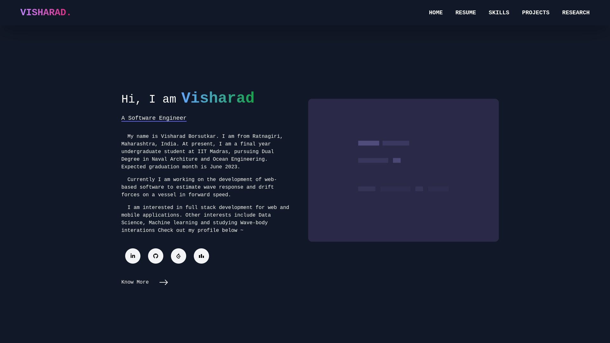

My portfolio website built using nextJS



- To run this repository locally
```bash
1. cd portfolio
2. npm i
   #or
   yarn install
3. npm run dev
   #or
   yarn dev
```
Tech stack :
 - TailwindCSS
 - NextJS
 - ReactJs

Repository Structure
```bash
$PROJECT_ROOT
│   # Page files
├── pages
|   |── _app.js
|   |── index.js
|   |── projects.js
|   |── research.js
|   |── resume.js
|   |── skils.js
|
│   # React component files
├── components
|   |── Main.js
|   |── Navbar.js
│
|   # Non-react modules
├── styles
│   # Static files for images and 3d model file
|── public
   |── skills 
   |── assets
```
